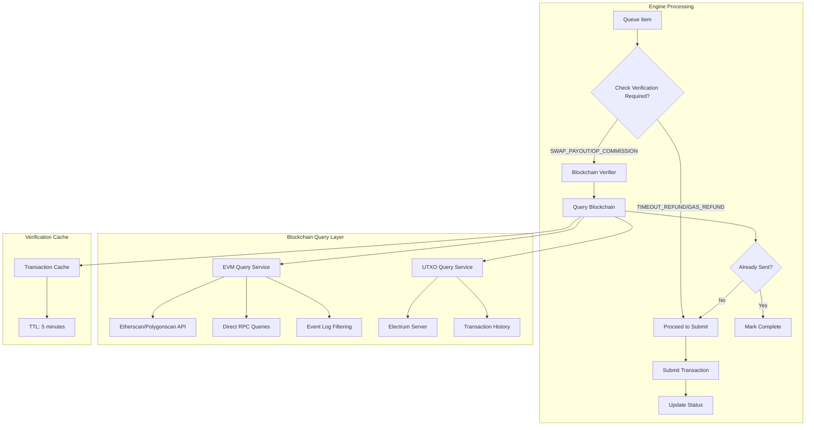

# Blockchain Verification System for Idempotent Transaction Submission

## Problem Statement
The system currently suffers from a catastrophic double-submission bug where SWAP_PAYOUT transactions are sent multiple times to the same address due to:
- Retry logic causing the same transaction to be submitted with different nonces
- Database state being out of sync with blockchain reality
- Network errors causing false negatives in submission status

## Solution Architecture

### Core Concept
For deterministic transactions (SWAP_PAYOUT and OP_COMMISSION), we can verify blockchain state BEFORE submission since we know:
1. **Sender**: Escrow address
2. **Recipient**: Deal party's recipient address or operator address
3. **Amount**: Exact amount from deal terms
4. **Asset**: ERC-20 contract address or native currency

## 1. High-Level Architecture



## 2. Method Signatures and Interfaces

### Core Verification Interface

```typescript
interface BlockchainVerificationService {
  /**
   * Check if a transaction matching the criteria has already been sent
   * @param escrow - Sender address (escrow account)
   * @param recipient - Recipient address
   * @param asset - Asset being sent (native or ERC-20 token address)
   * @param amount - Exact amount to verify
   * @param since - Optional: only check transactions after this timestamp
   * @returns True if transaction found on blockchain with sufficient confirmations
   */
  hasTransactionBeenSent(
    escrow: string,
    recipient: string,
    asset: string,
    amount: string,
    since?: Date
  ): Promise<boolean>;

  /**
   * Get detailed information about a matching transaction if it exists
   * @returns Transaction details or null if not found
   */
  findMatchingTransaction(
    escrow: string,
    recipient: string,
    asset: string,
    amount: string,
    since?: Date
  ): Promise<{
    txid: string;
    blockHeight: number;
    confirmations: number;
    timestamp: Date;
    status: 'pending' | 'confirmed' | 'failed';
  } | null>;
}
```

### Chain-Specific Implementations

```typescript
// EVM Implementation
class EVMBlockchainVerifier implements BlockchainVerificationService {
  constructor(
    private provider: ethers.Provider,
    private chainId: string,
    private etherscanAPI?: EtherscanAPI
  ) {}

  async hasTransactionBeenSent(
    escrow: string,
    recipient: string,
    asset: string,
    amount: string,
    since?: Date
  ): Promise<boolean> {
    if (this.isNativeAsset(asset)) {
      return this.verifyNativeTransfer(escrow, recipient, amount, since);
    } else if (asset.startsWith('ERC20:')) {
      return this.verifyERC20Transfer(escrow, recipient, asset, amount, since);
    }
    return false;
  }

  private async verifyERC20Transfer(
    escrow: string,
    recipient: string,
    asset: string,
    amount: string,
    since?: Date
  ): Promise<boolean> {
    const tokenAddress = asset.split(':')[1].split('@')[0];

    // Method 1: Query Transfer events via RPC
    const filter = {
      address: tokenAddress,
      topics: [
        ethers.id('Transfer(address,address,uint256)'),
        ethers.zeroPadValue(escrow, 32),
        ethers.zeroPadValue(recipient, 32)
      ],
      fromBlock: since ? await this.getBlockFromTimestamp(since) : 'earliest'
    };

    const logs = await this.provider.getLogs(filter);

    // Parse and check amounts
    for (const log of logs) {
      const parsedLog = this.parseTransferLog(log);
      if (this.amountMatches(parsedLog.amount, amount, tokenAddress)) {
        // Verify confirmations
        const currentBlock = await this.provider.getBlockNumber();
        const confirmations = currentBlock - log.blockNumber;
        if (confirmations >= this.getRequiredConfirmations()) {
          return true;
        }
      }
    }

    // Method 2: Fallback to Etherscan if available
    if (this.etherscanAPI) {
      const transfers = await this.etherscanAPI.getERC20Transfers(
        tokenAddress,
        recipient,
        since ? await this.getBlockFromTimestamp(since) : 0
      );

      return transfers.some(tx =>
        tx.from.toLowerCase() === escrow.toLowerCase() &&
        this.amountMatches(tx.amount, amount, tokenAddress) &&
        tx.confirmations >= this.getRequiredConfirmations()
      );
    }

    return false;
  }
}

// UTXO Implementation (Unicity)
class UTXOBlockchainVerifier implements BlockchainVerificationService {
  async hasTransactionBeenSent(
    escrow: string,
    recipient: string,
    asset: string,
    amount: string,
    since?: Date
  ): Promise<boolean> {
    // Get transaction history for the escrow address
    const scriptHash = this.addressToScriptHash(escrow);
    const history = await this.electrumRequest('blockchain.scripthash.get_history', [scriptHash]);

    // Check each transaction
    for (const tx of history) {
      const details = await this.getTransactionDetails(tx.tx_hash);

      // Check outputs for matching recipient and amount
      for (const output of details.outputs) {
        if (output.address === recipient &&
            this.amountMatches(output.value, amount) &&
            tx.confirmations >= this.getRequiredConfirmations()) {
          return true;
        }
      }
    }

    return false;
  }
}
```

## 3. Integration Points

### A. Engine.ts - submitQueueItemAtomic Method

```typescript
private async submitQueueItemAtomic(item: QueueItem, deal: Deal): Promise<void> {
  // NEW: Pre-submission verification for deterministic transactions
  if (this.shouldVerifyBeforeSubmission(item)) {
    const verifier = this.getVerifierForChain(item.chainId);

    // Determine the exact recipient and amount
    const recipient = this.getRecipientForVerification(item, deal);
    const amount = this.getAmountForVerification(item, deal);

    // Check blockchain state
    const alreadySent = await verifier.hasTransactionBeenSent(
      item.from.address,
      recipient,
      item.asset,
      amount,
      new Date(deal.createdAt)
    );

    if (alreadySent) {
      console.log(`[VERIFICATION] Transaction already sent on blockchain for ${item.purpose}`);

      // Get transaction details for logging
      const txDetails = await verifier.findMatchingTransaction(
        item.from.address,
        recipient,
        item.asset,
        amount,
        new Date(deal.createdAt)
      );

      // Mark queue item as completed without submitting
      this.queueRepo.updateStatus(item.id, 'COMPLETED', {
        txid: txDetails?.txid || 'VERIFIED_ON_CHAIN',
        verifiedOnChain: true,
        verifiedAt: new Date().toISOString()
      });

      this.dealRepo.addEvent(deal.id,
        `Skipped ${item.purpose} - already sent on chain (${txDetails?.txid || 'verified'})`
      );

      return; // Skip submission
    }
  }

  // Continue with existing submission logic...
  // [existing code]
}

private shouldVerifyBeforeSubmission(item: QueueItem): boolean {
  // Only verify deterministic transactions
  return item.purpose === 'SWAP_PAYOUT' || item.purpose === 'OP_COMMISSION';
}

private getRecipientForVerification(item: QueueItem, deal: Deal): string {
  if (item.purpose === 'SWAP_PAYOUT') {
    // For swap payouts, use the party's recipient address
    if (item.from.address === deal.escrowA?.address) {
      return deal.bobDetails?.recipientAddress || item.to;
    } else {
      return deal.aliceDetails?.recipientAddress || item.to;
    }
  } else if (item.purpose === 'OP_COMMISSION') {
    // For commission, use operator address
    return this.config.operatorAddresses[item.chainId] || item.to;
  }
  return item.to;
}

private getAmountForVerification(item: QueueItem, deal: Deal): string {
  // For SWAP_PAYOUT and OP_COMMISSION, use the exact queued amount
  // These are deterministic and should match exactly
  return item.amount;
}
```

### B. Chain Plugin Extensions

```typescript
// Extend ChainPlugin interface
interface ChainPlugin {
  // ... existing methods ...

  /**
   * Create a blockchain verifier for this chain
   * @returns Chain-specific verifier implementation
   */
  createVerifier(): BlockchainVerificationService;

  /**
   * Get transaction history for an address
   * @param address - Address to query
   * @param since - Optional: only get transactions after this block/time
   * @returns List of transactions involving this address
   */
  getTransactionHistory(
    address: string,
    since?: Date
  ): Promise<Transaction[]>;
}
```

## 4. Chain-Specific Implementation Details

### EVM Chains (Ethereum, Polygon)

**Query Methods:**
1. **Direct RPC Event Logs** (Primary)
   - Use `eth_getLogs` with Transfer event signature
   - Filter by from/to addresses in topics
   - Parse amount from data field
   - Most reliable and real-time

2. **Etherscan/Polygonscan API** (Fallback)
   - Use `tokentx` endpoint for ERC-20 transfers
   - Use `txlist` endpoint for native transfers
   - Handles rate limiting and API key requirements

**Confirmation Strategy:**
- ETH: 3 confirmations minimum
- Polygon: 64 confirmations minimum
- Count transaction as "sent" only if confirmations meet threshold

### UTXO Chains (Unicity)

**Query Methods:**
1. **Electrum Server Queries**
   - Get transaction history via `blockchain.scripthash.get_history`
   - Fetch full transaction details
   - Check outputs for matching recipient/amount

2. **UTXO Analysis**
   - Track spent UTXOs to detect outgoing transactions
   - Verify change outputs returned to escrow

**Confirmation Strategy:**
- 6 confirmations minimum
- Handle multi-output transactions correctly

## 5. Edge Cases and Error Handling

### A. Transaction Amount Matching

```typescript
private amountMatches(
  blockchainAmount: string,
  expectedAmount: string,
  tokenAddress?: string
): boolean {
  // Handle decimal precision issues
  const tolerance = this.getToleranceForAsset(tokenAddress);

  // Convert to smallest units for comparison
  const blockchain = this.parseAmount(blockchainAmount, tokenAddress);
  const expected = this.parseAmount(expectedAmount, tokenAddress);

  // Check if within tolerance (for gas adjustments)
  const difference = Math.abs(blockchain - expected);
  return difference <= tolerance;
}
```

### B. Pending Transaction Handling

```typescript
enum VerificationDecision {
  NOT_FOUND,        // Transaction doesn't exist
  PENDING,          // Found but unconfirmed
  CONFIRMED,        // Found with sufficient confirmations
  FAILED            // Transaction failed/reverted
}

private async getVerificationDecision(
  txDetails: TransactionDetails | null
): Promise<VerificationDecision> {
  if (!txDetails) return VerificationDecision.NOT_FOUND;

  if (txDetails.status === 'failed') {
    return VerificationDecision.FAILED;
  }

  if (txDetails.confirmations < this.requiredConfirmations) {
    return VerificationDecision.PENDING;
  }

  return VerificationDecision.CONFIRMED;
}

// In submitQueueItemAtomic:
const decision = await this.getVerificationDecision(txDetails);
switch (decision) {
  case VerificationDecision.CONFIRMED:
    // Mark as complete, skip submission
    break;
  case VerificationDecision.PENDING:
    // Wait for confirmation, skip submission for now
    this.dealRepo.addEvent(deal.id, `${item.purpose} pending on chain`);
    return;
  case VerificationDecision.FAILED:
    // Proceed with new submission
    break;
  case VerificationDecision.NOT_FOUND:
    // Proceed with submission
    break;
}
```

### C. Network Query Failures

```typescript
private async verifyWithRetry(
  verifier: BlockchainVerificationService,
  params: VerificationParams,
  maxRetries: number = 3
): Promise<boolean> {
  for (let attempt = 0; attempt < maxRetries; attempt++) {
    try {
      return await verifier.hasTransactionBeenSent(
        params.escrow,
        params.recipient,
        params.asset,
        params.amount,
        params.since
      );
    } catch (error) {
      if (attempt === maxRetries - 1) {
        // Final attempt failed
        console.error(`Blockchain verification failed after ${maxRetries} attempts:`, error);

        // Fail-safe decision: Allow submission
        // Better to risk double-send than block all transactions
        console.warn('Proceeding with submission despite verification failure');
        return false;
      }

      // Exponential backoff
      const delay = Math.pow(2, attempt) * 1000;
      await new Promise(resolve => setTimeout(resolve, delay));
    }
  }
  return false;
}
```

## 6. Performance Optimizations

### A. Caching Layer

```typescript
class VerificationCache {
  private cache = new Map<string, {
    result: boolean;
    timestamp: number;
    txDetails?: TransactionDetails;
  }>();

  private readonly TTL = 5 * 60 * 1000; // 5 minutes

  getCacheKey(params: VerificationParams): string {
    return `${params.escrow}-${params.recipient}-${params.asset}-${params.amount}`;
  }

  get(params: VerificationParams): boolean | null {
    const key = this.getCacheKey(params);
    const entry = this.cache.get(key);

    if (!entry) return null;

    if (Date.now() - entry.timestamp > this.TTL) {
      this.cache.delete(key);
      return null;
    }

    return entry.result;
  }

  set(params: VerificationParams, result: boolean, txDetails?: TransactionDetails): void {
    const key = this.getCacheKey(params);
    this.cache.set(key, {
      result,
      timestamp: Date.now(),
      txDetails
    });
  }
}
```

### B. Block Range Optimization

```typescript
private async getOptimalBlockRange(
  dealCreatedAt: Date,
  chainId: string
): Promise<{ fromBlock: number; toBlock: number }> {
  // Calculate approximate block based on deal creation time
  const currentBlock = await this.provider.getBlockNumber();
  const blocksPerDay = this.getBlocksPerDay(chainId);
  const daysSinceDeal = (Date.now() - dealCreatedAt.getTime()) / (1000 * 60 * 60 * 24);
  const estimatedBlocks = Math.floor(daysSinceDeal * blocksPerDay);

  // Add buffer for safety
  const fromBlock = Math.max(0, currentBlock - estimatedBlocks - 1000);
  const toBlock = currentBlock;

  return { fromBlock, toBlock };
}
```

## 7. Monitoring and Alerts

### A. Verification Metrics

```typescript
interface VerificationMetrics {
  totalVerifications: number;
  duplicatesDetected: number;
  verificationFailures: number;
  averageVerificationTime: number;
  cacheHitRate: number;
}

class VerificationMonitor {
  logVerification(
    dealId: string,
    purpose: string,
    result: 'duplicate' | 'new' | 'error',
    duration: number
  ): void {
    // Log to monitoring system
    console.log({
      event: 'blockchain_verification',
      dealId,
      purpose,
      result,
      duration,
      timestamp: new Date().toISOString()
    });

    // Alert on high duplicate rate
    if (this.getDuplicateRate() > 0.1) {
      this.alertHighDuplicateRate();
    }
  }
}
```

### B. Critical Alerts

1. **High Duplicate Detection Rate**
   - Threshold: > 10% of verifications finding duplicates
   - Action: Investigate submission logic

2. **Verification Failures**
   - Threshold: > 3 consecutive failures
   - Action: Check RPC/API connectivity

3. **Slow Verification**
   - Threshold: > 10 seconds average
   - Action: Optimize queries or increase cache TTL

## 8. Testing Strategy

### Unit Tests

```typescript
describe('BlockchainVerificationService', () => {
  it('should detect already sent SWAP_PAYOUT', async () => {
    // Mock blockchain with existing transaction
    const verifier = new MockVerifier([
      {
        from: '0xescrow',
        to: '0xrecipient',
        amount: '100',
        asset: 'USDT',
        confirmations: 10
      }
    ]);

    const result = await verifier.hasTransactionBeenSent(
      '0xescrow',
      '0xrecipient',
      'USDT',
      '100'
    );

    expect(result).toBe(true);
  });

  it('should handle amount precision differences', async () => {
    // Test with slightly different amounts due to gas
    const result = await verifier.hasTransactionBeenSent(
      '0xescrow',
      '0xrecipient',
      'ETH',
      '1.000000000000000001'
    );

    expect(result).toBe(true); // Should match 1.0 ETH transaction
  });
});
```

### Integration Tests

```typescript
describe('Engine with Verification', () => {
  it('should skip submission of duplicate SWAP_PAYOUT', async () => {
    // Setup deal with SWAP_PAYOUT queue item
    const deal = createTestDeal();
    const queueItem = createSwapPayoutItem(deal);

    // Mock blockchain to return existing transaction
    mockBlockchain.addTransaction({
      from: queueItem.from.address,
      to: queueItem.to,
      amount: queueItem.amount,
      asset: queueItem.asset
    });

    // Process queue item
    await engine.submitQueueItemAtomic(queueItem, deal);

    // Verify no new transaction was submitted
    expect(mockPlugin.send).not.toHaveBeenCalled();

    // Verify queue item marked as completed
    expect(queueItem.status).toBe('COMPLETED');
  });
});
```

## 9. Migration Plan

### Phase 1: Implementation (Week 1)
1. Implement BlockchainVerificationService interface
2. Create EVM and UTXO verifier implementations
3. Add verification cache layer

### Phase 2: Integration (Week 2)
1. Integrate verification into submitQueueItemAtomic
2. Add monitoring and metrics
3. Deploy to test environment

### Phase 3: Testing (Week 3)
1. Run parallel verification (log-only mode)
2. Validate detection accuracy
3. Performance testing

### Phase 4: Rollout (Week 4)
1. Enable for OP_COMMISSION first (lower risk)
2. Monitor for 48 hours
3. Enable for SWAP_PAYOUT
4. Full production deployment

## 10. Configuration

### Environment Variables

```bash
# Verification Settings
BLOCKCHAIN_VERIFICATION_ENABLED=true
VERIFICATION_CACHE_TTL=300  # seconds
VERIFICATION_MAX_RETRIES=3
VERIFICATION_FAIL_SAFE=allow  # allow|block on verification failure

# Chain-specific settings
ETH_VERIFICATION_CONFIRMATIONS=3
POLYGON_VERIFICATION_CONFIRMATIONS=64
UNICITY_VERIFICATION_CONFIRMATIONS=6

# Etherscan API Keys (optional but recommended)
ETHERSCAN_API_KEY=your_key_here
POLYGONSCAN_API_KEY=your_key_here
```

## Summary

This blockchain verification system provides:

1. **Idempotency**: Guarantees that SWAP_PAYOUT and OP_COMMISSION are never double-sent
2. **Resilience**: Handles network failures, reorgs, and database inconsistencies
3. **Performance**: Caching and optimized queries for minimal latency
4. **Observability**: Comprehensive monitoring and alerting
5. **Flexibility**: Chain-specific implementations with common interface

The system acts as a final safeguard, checking blockchain truth before any deterministic transaction submission, making the system truly idempotent regardless of database state or retry logic complications.